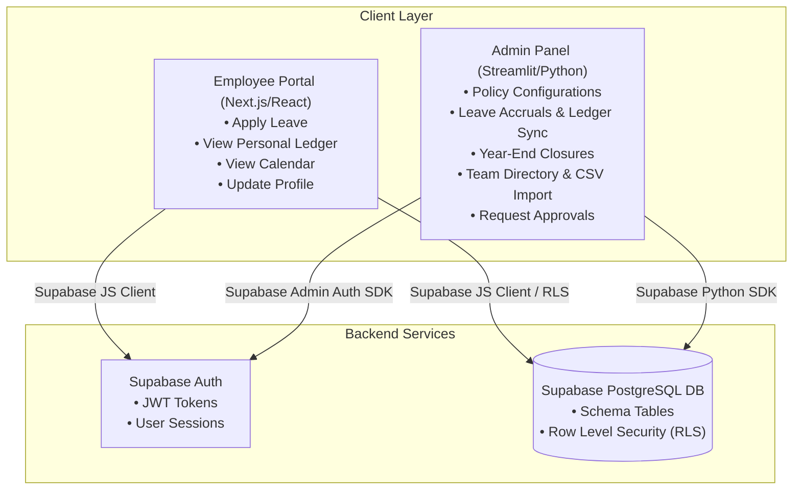

# Technical Migration Plan: Converting LMS to Next.js (Frontend) + Supabase (Database & Auth) + Streamlit (Admin/Backend)

This document provides a comprehensive, step-by-step technical plan to migrate the Leave Management System (LMS) from its current stack (Next.js Monolith with Prisma and local SQLite/PostgreSQL) to a modern, decoupled architecture:
*   **Database & Authentication:** Supabase (PostgreSQL, Supabase Auth, Row Level Security)
*   **Employee Frontend:** Next.js / React (preserving the exact existing UI designs and components)
*   **Backend & Administrative Panel:** Streamlit (Python-based dashboard for HR Administrators and Managers to execute business logic, configure policies, and perform management tasks)

---

## 1. Target Architecture Overview

The migrated system will decouple employee-facing interactions from administrative operations:



### Key Division of Responsibilities
1.  **Next.js (Employee Portal):** Retains the current premium styling, animations (such as the loading states and `PuppyLoader`), layouts, and components. Communicates directly with Supabase via the `@supabase/supabase-js` client.
2.  **Supabase:** Serves as the central PostgreSQL database. Enforces security using Row Level Security (RLS) policies so employees can only query their own leave balances and requests, while Admin/Manager roles have elevated query privileges. Supabase Auth replaces Next-Auth credentials login.
3.  **Streamlit (HR/Admin Panel):** Houses the core administrative business logic (e.g., proration calculations, monthly PL accrual engines, year-end balance rollovers, ledger rebuilding/syncing). It runs as a Python web application that reads/writes directly to Supabase with admin bypass tokens.

---

## 2. Supabase Database Schema & Migration

The Prisma PostgreSQL schema will map directly to Supabase tables. Since Supabase runs on PostgreSQL, we can migrate the table structures directly.

### Table Mapping Table

| Prisma Model | Supabase Table Name | Primary Keys & Notes |
| :--- | :--- | :--- |
| `User` | `profiles` | Linked to `auth.users.id` via Foreign Key. Stores `role`, `status`, `department_id`, etc. |
| `Department` | `departments` | Unique names, auto-incrementing/CUID-based string. |
| `LeaveLedgerEntry` | `leave_ledger_entries` | Stores running history of PL/CL credits and debits. |
| `LeaveBalance` | `leave_balances` | Stores live balances (`pl`, `cl`, `sl`, `comp`). |
| `LeaveRequest` | `leave_requests` | Stores start, end, half-day configurations, and status. |
| `Holiday` | `holidays` | System-wide public holidays table. |
| `WeekendConfig` | `weekend_configs` | Location-specific weekend working parameters. |
| `CompOffWorkEntry` | `comp_off_work_entries` | Compensatory leave earned for weekend/holiday work. |
| `SystemConfig` | `system_configs` | Key-value settings (PL Accrual rate, sandwich rules, etc.). |
| `LeaveYearClosure` | `leave_year_closures` | Records of completed year-end freezes. |
| `LeaveBalanceAdjustment` | `leave_balance_adjustments` | Auditable manual balance edits by admins. |
| `NegativeLeaveTracking` | `negative_leave_trackings` | Monitors salary recoveries or write-offs for negative leaves. |
| `SystemDateOverride` | `system_date_overrides` | Stores test-mode date overrides for time-travel. |
| `CarryForwardHistory` | `carry_forward_histories` | Archives PL carry-forwards during year-end resets. |
| `AuditLog` | `audit_logs` | Security tracking logs. |

### Supabase SQL Initialization Script

Execute the following script in the Supabase SQL Editor to set up the schema:

```sql
-- Enable CUID-like UUID generation or use default uuid_generate_v4()
CREATE EXTENSION IF NOT EXISTS "uuid-ossp";

-- 1. Departments Table
CREATE TABLE departments (
    id TEXT PRIMARY KEY DEFAULT uuid_generate_v4()::text,
    name TEXT UNIQUE NOT NULL,
    created_at TIMESTAMP WITH TIME ZONE DEFAULT timezone('utc'::text, now()) NOT NULL,
    updated_at TIMESTAMP WITH TIME ZONE DEFAULT timezone('utc'::text, now()) NOT NULL
);

-- 2. Profiles Table (Extends Supabase auth.users)
CREATE TABLE profiles (
    id UUID PRIMARY KEY REFERENCES auth.users(id) ON DELETE CASCADE,
    name TEXT NOT NULL,
    email TEXT UNIQUE NOT NULL,
    role TEXT NOT NULL DEFAULT 'EMPLOYEE', -- 'ADMIN', 'MANAGER', 'EMPLOYEE'
    department_id TEXT REFERENCES departments(id) ON DELETE SET NULL,
    join_date TIMESTAMP WITH TIME ZONE DEFAULT timezone('utc'::text, now()) NOT NULL,
    days_worked INT NOT NULL DEFAULT 0,
    status TEXT NOT NULL DEFAULT 'ACTIVE', -- 'ACTIVE', 'RESIGNED', 'NOTICE_PERIOD'
    last_working_day TIMESTAMP WITH TIME ZONE,
    probation_end_date TIMESTAMP WITH TIME ZONE,
    communication_email TEXT NOT NULL DEFAULT 'hr@company.com',
    created_at TIMESTAMP WITH TIME ZONE DEFAULT timezone('utc'::text, now()) NOT NULL,
    updated_at TIMESTAMP WITH TIME ZONE DEFAULT timezone('utc'::text, now()) NOT NULL
);

-- Trigger to automatically create a profile on signup
CREATE OR REPLACE FUNCTION public.handle_new_user()
RETURNS TRIGGER AS $$
BEGIN
  INSERT INTO public.profiles (id, name, email, role, communication_email)
  VALUES (
    new.id,
    coalesce(new.raw_user_meta_data->>'name', 'New Employee'),
    new.email,
    coalesce(new.raw_user_meta_data->>'role', 'EMPLOYEE'),
    new.email
  );
  RETURN NEW;
END;
$$ LANGUAGE plpgsql SECURITY DEFINER;

CREATE OR REPLACE TRIGGER on_auth_user_created
  AFTER INSERT ON auth.users
  FOR EACH ROW EXECUTE FUNCTION public.handle_new_user();

-- 3. Leave Balances Table
CREATE TABLE leave_balances (
    id TEXT PRIMARY KEY DEFAULT uuid_generate_v4()::text,
    user_id UUID NOT NULL REFERENCES profiles(id) ON DELETE CASCADE UNIQUE,
    year INT NOT NULL DEFAULT 2026,
    opening_pl FLOAT NOT NULL DEFAULT 0.0,
    opening_cl FLOAT NOT NULL DEFAULT 0.0,
    opening_comp FLOAT NOT NULL DEFAULT 0.0,
    pl FLOAT NOT NULL DEFAULT 0.0,
    cl FLOAT NOT NULL DEFAULT 0.0,
    sl FLOAT NOT NULL DEFAULT 0.0,
    comp FLOAT NOT NULL DEFAULT 0.0,
    lop FLOAT NOT NULL DEFAULT 0.0,
    mat FLOAT NOT NULL DEFAULT 0.0,
    pl_accrued FLOAT NOT NULL DEFAULT 0.0,
    pl_used FLOAT NOT NULL DEFAULT 0.0,
    cl_used FLOAT NOT NULL DEFAULT 0.0,
    sl_used FLOAT NOT NULL DEFAULT 0.0,
    pl_carry_forward FLOAT NOT NULL DEFAULT 0.0,
    created_at TIMESTAMP WITH TIME ZONE DEFAULT timezone('utc'::text, now()) NOT NULL,
    updated_at TIMESTAMP WITH TIME ZONE DEFAULT timezone('utc'::text, now()) NOT NULL
);

-- 4. Leave Requests Table
CREATE TABLE leave_requests (
    id TEXT PRIMARY KEY DEFAULT uuid_generate_v4()::text,
    user_id UUID NOT NULL REFERENCES profiles(id) ON DELETE CASCADE,
    type TEXT NOT NULL, -- 'PL', 'CL', 'SL', 'COMP', 'LOP', 'MAT'
    start_date TIMESTAMP WITH TIME ZONE NOT NULL,
    end_date TIMESTAMP WITH TIME ZONE NOT NULL,
    half_day TEXT NOT NULL DEFAULT 'NONE', -- 'NONE', 'FIRST_HALF', 'SECOND_HALF'
    reason TEXT NOT NULL,
    status TEXT NOT NULL DEFAULT 'PENDING', -- 'PENDING', 'L1_APPROVED', 'HR_APPROVED', 'REJECTED', 'CANCELLED'
    is_negative BOOLEAN NOT NULL DEFAULT FALSE,
    negative_amount FLOAT NOT NULL DEFAULT 0.0,
    attachment_url TEXT,
    year INT NOT NULL DEFAULT 2026,
    approved_by_id UUID REFERENCES profiles(id) ON DELETE SET NULL,
    approved_at TIMESTAMP WITH TIME ZONE,
    created_at TIMESTAMP WITH TIME ZONE DEFAULT timezone('utc'::text, now()) NOT NULL,
    updated_at TIMESTAMP WITH TIME ZONE DEFAULT timezone('utc'::text, now()) NOT NULL
);

-- 5. Leave Ledger Entries Table
CREATE TABLE leave_ledger_entries (
    id TEXT PRIMARY KEY DEFAULT uuid_generate_v4()::text,
    user_id UUID NOT NULL REFERENCES profiles(id) ON DELETE CASCADE,
    date TIMESTAMP WITH TIME ZONE NOT NULL,
    type TEXT NOT NULL, -- 'OPENING', 'CLOSING', 'PL', 'CL', 'ACCRUAL', 'ADJ-PL', etc.
    description TEXT NOT NULL,
    start_date TIMESTAMP WITH TIME ZONE,
    end_date TIMESTAMP WITH TIME ZONE,
    days FLOAT,
    cl_debit FLOAT,
    cl_credit FLOAT,
    cl_balance FLOAT NOT NULL,
    pl_debit FLOAT,
    pl_credit FLOAT,
    pl_balance FLOAT NOT NULL,
    working_days FLOAT,
    is_opening BOOLEAN NOT NULL DEFAULT FALSE,
    is_adjustment BOOLEAN NOT NULL DEFAULT FALSE,
    is_closing BOOLEAN NOT NULL DEFAULT FALSE,
    created_at TIMESTAMP WITH TIME ZONE DEFAULT timezone('utc'::text, now()) NOT NULL,
    updated_at TIMESTAMP WITH TIME ZONE DEFAULT timezone('utc'::text, now()) NOT NULL
);

CREATE INDEX idx_ledger_user_date ON leave_ledger_entries(user_id, date);

-- 6. System Configs Table
CREATE TABLE system_configs (
    id TEXT PRIMARY KEY DEFAULT uuid_generate_v4()::text,
    key TEXT UNIQUE NOT NULL,
    value TEXT NOT NULL,
    description TEXT,
    created_at TIMESTAMP WITH TIME ZONE DEFAULT timezone('utc'::text, now()) NOT NULL,
    updated_at TIMESTAMP WITH TIME ZONE DEFAULT timezone('utc'::text, now()) NOT NULL
);

-- 7. Holidays Table
CREATE TABLE holidays (
    id TEXT PRIMARY KEY DEFAULT uuid_generate_v4()::text,
    date TIMESTAMP WITH TIME ZONE UNIQUE NOT NULL,
    name TEXT NOT NULL,
    type TEXT NOT NULL DEFAULT 'FIXED', -- 'FIXED', 'FLOATING'
    location TEXT,
    is_optional BOOLEAN NOT NULL DEFAULT FALSE,
    created_at TIMESTAMP WITH TIME ZONE DEFAULT timezone('utc'::text, now()) NOT NULL,
    updated_at TIMESTAMP WITH TIME ZONE DEFAULT timezone('utc'::text, now()) NOT NULL
);

-- 8. Leave Balance Adjustments Table
CREATE TABLE leave_balance_adjustments (
    id TEXT PRIMARY KEY DEFAULT uuid_generate_v4()::text,
    user_id UUID NOT NULL REFERENCES profiles(id) ON DELETE CASCADE,
    leave_type TEXT NOT NULL,
    amount FLOAT NOT NULL,
    adjustment_type TEXT NOT NULL,
    reason TEXT NOT NULL,
    effective_year INT NOT NULL,
    entered_by UUID NOT NULL REFERENCES profiles(id),
    entered_by_name TEXT NOT NULL,
    remarks TEXT,
    created_at TIMESTAMP WITH TIME ZONE DEFAULT timezone('utc'::text, now()) NOT NULL
);
```

### Row Level Security (RLS) Rules
To maintain data isolation, enable RLS on private employee data tables:

```sql
-- Enable RLS
ALTER TABLE profiles ENABLE ROW LEVEL SECURITY;
ALTER TABLE leave_balances ENABLE ROW LEVEL SECURITY;
ALTER TABLE leave_requests ENABLE ROW LEVEL SECURITY;
ALTER TABLE leave_ledger_entries ENABLE ROW LEVEL SECURITY;

-- Profiles Policies
CREATE POLICY "Users can view their own profile" ON profiles
    FOR SELECT USING (auth.uid() = id);

CREATE POLICY "Admins/Managers can view all profiles" ON profiles
    FOR ALL USING (
        EXISTS (
            SELECT 1 FROM profiles 
            WHERE profiles.id = auth.uid() AND profiles.role IN ('ADMIN', 'MANAGER')
        )
    );

-- Leave Balances Policies
CREATE POLICY "Users can view their own balances" ON leave_balances
    FOR SELECT USING (auth.uid() = user_id);

CREATE POLICY "Admins/Managers can manage all balances" ON leave_balances
    FOR ALL USING (
        EXISTS (
            SELECT 1 FROM profiles 
            WHERE profiles.id = auth.uid() AND profiles.role IN ('ADMIN', 'MANAGER')
        )
    );
```

---

## 3. Frontend Authentication Migration (Next-Auth to Supabase Auth)

The current project uses Next-Auth credentials-based login. We will migrate to Supabase Email Authentication.

### Setup Supabase JS Client
Install the required packages in the Next.js frontend project:
```bash
npm install @supabase/supabase-js @supabase/ssr
```

### Rewrite Login Page (`src/app/login/page.tsx`)
Retain the exact visual design of the split-pane layout and login animation triggers. Replace `signIn("credentials", ...)` with Supabase sign-in client calls.

**Next.js API Code Diff / Migration Blueprint:**
```typescript
// Replace:
// const res = await signIn("credentials", { email, password, redirect: false })

// With:
import { createBrowserClient } from '@supabase/ssr'

const supabase = createBrowserClient(
  process.env.NEXT_PUBLIC_SUPABASE_URL!,
  process.env.NEXT_PUBLIC_SUPABASE_ANON_KEY!
)

const handleLogin = async (e: React.FormEvent) => {
  e.preventDefault()
  setLoading(true)
  
  const { data, error } = await supabase.auth.signInWithPassword({
    email,
    password
  })
  
  setLoading(false)
  if (error) {
    toast.error(error.message)
  } else {
    toast.success("Welcome back!")
    router.push("/portal")
    router.refresh()
  }
}
```

### Next.js Middleware Replacement
Replace `src/middleware.ts` with a Supabase session checking middleware that intercepts unauthorized pages:

```typescript
import { createServerClient } from '@supabase/ssr'
import { NextResponse, type NextRequest } from 'next/server'

export async function middleware(request: NextRequest) {
  let response = NextResponse.next({
    request: {
      headers: request.headers,
    },
  })

  const supabase = createServerClient(
    process.env.NEXT_PUBLIC_SUPABASE_URL!,
    process.env.NEXT_PUBLIC_SUPABASE_ANON_KEY!,
    {
      cookies: {
        getAll() {
          return request.cookies.getAll()
        },
        setAll(cookiesToSet) {
          cookiesToSet.forEach(({ name, value, options }) => request.cookies.set(name, value))
          response = NextResponse.next({
            request,
          })
          cookiesToSet.forEach(({ name, value, options }) =>
            response.cookies.set(name, value, options)
          )
        },
      },
    }
  )

  const { data: { session } } = await supabase.auth.getSession()

  // Protect all employee routes, ignore /login, /api/auth, static assets
  if (!session && !request.nextUrl.pathname.startsWith('/login') && request.nextUrl.pathname !== '/') {
    return NextResponse.redirect(new URL('/login', request.url))
  }

  return response
}

export const config = {
  matcher: ['/((?!_next/static|_next/image|favicon.ico|api/auth).*)'],
}
```

---

## 4. Frontend Code Restructure (No UI Modifications)

Keep all UI screens—including `My Portal` (applying leave), `Leave Ledger` (viewing transactions), `Calendar` (holiday viewing), and `Profile` (user details)—intact. Modify only their data fetching and server mutation methods.

### Refactoring Server-Side Fetching in Next.js Page Components
In pages like `src/app/ledger/page.tsx` and `src/app/requests/register/page.tsx`, swap Prisma calls out for Supabase Server Client calls:

**Example Migration (`src/app/ledger/page.tsx`):**
```typescript
// OLD:
// const [clBalanceSetting, user, ledgerEntries] = await Promise.all([
//   prisma.systemConfig.findUnique({ where: { key: 'SHOW_CL_BALANCE_TO_EMPLOYEE' } }),
//   prisma.user.findUnique({ where: { id: targetUserId }, include: { balances: true } })
// ...

// NEW (Supabase Server Action/Client):
import { createServerClient } from '@supabase/ssr'
import { cookies } from 'next/headers'

const cookieStore = await cookies()
const supabase = createServerClient(
  process.env.NEXT_PUBLIC_SUPABASE_URL!,
  process.env.NEXT_PUBLIC_SUPABASE_ANON_KEY!,
  {
    cookies: {
      getAll() { return cookieStore.getAll() }
    }
  }
)

// Fetch configurations
const { data: configData } = await supabase
  .from('system_configs')
  .select('value')
  .eq('key', 'SHOW_CL_BALANCE_TO_EMPLOYEE')
  .single()

// Fetch user profile and balances
const { data: profile } = await supabase
  .from('profiles')
  .select('*, leave_balances(*), departments(name)')
  .eq('id', targetUserId)
  .single()

// Fetch ledger entries
const { data: ledgerEntries } = await supabase
  .from('leave_ledger_entries')
  .select('*')
  .eq('user_id', targetUserId)
  .order('date', { ascending: true })
```

---

## 5. Streamlit Administrative Backend & Panel

Since HR Administrators and Managers perform complex business actions—such as running year-end closings, recalculating proration rules, importing CSV profiles, and overriding system test times—we implement **Streamlit** as a centralized Python dashboard. 

### Why Streamlit?
1.  **Fast Implementation:** Streamlit turns Python scripts into interactive web screens instantaneously, ideal for administrative tools.
2.  **Pure Business Logic:** Python contains robust date manipulation engines (`pandas`, `datetime`, `dateutil`) to execute accruals and balance validations easily.
3.  **Secure Access:** Run behind an internal firewall or authenticate using Supabase's Python JWT checker.

### Setting up the Streamlit Environment
Create a folder `admin_panel` in the project root:
```
admin_panel/
│   requirements.txt
│   app.py
│   supabase_client.py
│   calculations.py
```

`admin_panel/requirements.txt`:
```text
streamlit>=1.30.0
supabase>=2.3.0
pandas>=2.0.0
python-dateutil>=2.8.2
plotly>=5.15.0
```

### Pythonsupa Database Integrations (`admin_panel/supabase_client.py`)
```python
import os
from supabase import create_client, Client
import streamlit as st

@st.cache_resource
def get_supabase_client() -> Client:
    # Uses service role key for admin transactions (e.g. bypass RLS for proration updates)
    url = os.environ.get("SUPABASE_URL") or st.secrets["SUPABASE_URL"]
    key = os.environ.get("SUPABASE_SERVICE_KEY") or st.secrets["SUPABASE_SERVICE_KEY"]
    return create_client(url, key)
```

### Administrative Calculations (`admin_panel/calculations.py`)
Translate the JavaScript leave accrual checks (`src/lib/accrualEngine.ts`) and sandwich logic (`src/lib/leaveCalculator.ts`) into Python code:

```python
import datetime
from dateutil.relativedelta import relativedelta

def calculate_requested_days(start_date: datetime.date, end_date: datetime.date, holiday_dates: set, is_sandwich_enabled: bool, leave_type: str, is_half_day: bool = False) -> float:
    if is_half_day:
        return 0.5
        
    days = 0
    current_date = start_date
    
    # Sandwich rule applies to CL (Casual Leave) if configured
    apply_sandwich = (leave_type == "CL" and is_sandwich_enabled)
    
    while current_date <= end_date:
        # Check if day is weekend (Saturday = 5, Sunday = 6 in python weekday())
        is_wknd = current_date.weekday() in [5, 6]
        is_hol = str(current_date) in holiday_dates
        
        if apply_sandwich:
            days += 1
        else:
            if not is_wknd and not is_hol:
                days += 1
        current_date += datetime.timedelta(days=1)
        
    return float(days)

def calculate_monthly_pl_accrual(supabase_client, user_id: str, year: int, month: int):
    # Retrieve configurations from database
    configs = supabase_client.table("system_configs").select("*").execute().data
    config_dict = {c['key']: c['value'] for c in configs}
    
    rate = float(config_dict.get("ACCRUAL_RATE_PL", 1.5))
    base_days = int(config_dict.get("ACCRUAL_BASE_DAYS", 20))
    threshold = int(config_dict.get("MIN_WORKED_DAYS_FOR_PL", 15))
    
    # Get month boundaries
    start_date = datetime.date(year, month, 1)
    # Get last day of month
    if month == 12:
        end_date = datetime.date(year + 1, 1, 1) - datetime.timedelta(days=1)
    else:
        end_date = datetime.date(year, month + 1, 1) - datetime.timedelta(days=1)
        
    total_days = (end_date - start_date).days + 1
    
    # Count weekends
    weekends_count = 0
    curr = start_date
    while curr <= end_date:
        if curr.weekday() in [5, 6]:
            weekends_count += 1
        curr += datetime.timedelta(days=1)
        
    # Query holidays
    holidays = supabase_client.table("holidays").select("date").gte("date", start_date.isoformat()).lte("date", end_date.isoformat()).execute().data
    holidays_count = len(holidays)
    
    # Query approved leaves within the month
    leaves = supabase_client.table("leave_requests").select("*").eq("user_id", user_id).eq("status", "HR_APPROVED").execute().data
    
    leave_days_count = 0
    for l in leaves:
        l_start = datetime.datetime.fromisoformat(l['start_date']).date()
        l_end = datetime.datetime.fromisoformat(l['end_date']).date()
        
        # Overlap boundaries
        overlap_start = max(start_date, l_start)
        overlap_end = min(end_date, l_end)
        
        if overlap_start <= overlap_end:
            leave_days_count += (overlap_end - overlap_start).days + 1
            
    working_days = total_days - weekends_count - holidays_count - leave_days_count
    
    if working_days < threshold:
        return 0.0, f"Working days ({working_days}) below threshold ({threshold})"
        
    accrued = (working_days / base_days) * rate if base_days > 0 else 0.0
    return round(accrued, 2), "Eligible"
```

### Implementing Ledger Sync Logic in Python
Mirror the logical rebuild from `src/lib/ledgerSync.ts` to guarantee accounting parity:

```python
def sync_user_ledger(supabase_client, user_id: str, year: int = 2026):
    start_of_year = f"{year}-01-01T00:00:00Z"
    end_of_year = f"{year}-12-31T23:59:59Z"
    
    # 1. Fetch user profile, holiday settings, and configurations
    user = supabase_client.table("profiles").select("*, leave_balances(*)").eq("id", user_id).single().execute().data
    holidays = supabase_client.table("holidays").select("date").execute().data
    sandwich_rule = supabase_client.table("system_configs").select("value").eq("key", "weekend_sandwich_rule").single().execute().data
    
    if not user or not user.get('leave_balances'):
        return
        
    holiday_dates = {h['date'].split('T')[0] for h in holidays}
    is_sandwich_enabled = (sandwich_rule.get('value') == 'true') if sandwich_rule else False
    
    # 2. Delete existing ledger entries for this user/year
    supabase_client.table("leave_ledger_entries").delete().eq("user_id", user_id).gte("date", start_of_year).lte("date", end_of_year).execute()
    
    # 3. Pull all updates
    approved_leaves = supabase_client.table("leave_requests").select("*").eq("user_id", user_id).eq("status", "HR_APPROVED").order("start_date").execute().data
    adjustments = supabase_client.table("leave_balance_adjustments").select("*").eq("user_id", user_id).eq("effective_year", year).order("created_at").execute().data
    
    # Extract opening variables
    opening_cl = user['leave_balances']['opening_cl']
    opening_pl = user['leave_balances']['opening_pl']
    
    cl_bal = opening_cl
    pl_bal = opening_pl
    
    ledger_entries = []
    
    # Add Opening Log
    ledger_entries.append({
        "user_id": user_id,
        "date": start_of_year,
        "type": "OPENING",
        "description": f"Opening Balance — 1 Jan {year}",
        "cl_credit": opening_cl,
        "pl_credit": opening_pl,
        "cl_balance": cl_bal,
        "pl_balance": pl_bal,
        "is_opening": True
    })
    
    # Sort events chronologically
    events = []
    for l in approved_leaves:
        events.append({"kind": "leave", "date": l['start_date'], "data": l})
    for a in adjustments:
        events.append({"kind": "adj", "date": a['created_at'], "data": a})
    events.sort(key=lambda x: x['date'])
    
    for ev in events:
        if ev['kind'] == 'leave':
            leave = ev['data']
            start_dt = datetime.datetime.fromisoformat(leave['start_date']).date()
            end_dt = datetime.datetime.fromisoformat(leave['end_date']).date()
            
            days = calculate_requested_days(start_dt, end_dt, holiday_dates, is_sandwich_enabled, leave['type'], leave['half_day'] != 'NONE')
            
            cl_debit, pl_debit = None, None
            if leave['type'] == 'CL':
                cl_debit = days
                cl_bal -= days
            elif leave['type'] == 'PL':
                pl_debit = days
                pl_bal -= days
            else:
                continue
                
            ledger_entries.append({
                "user_id": user_id,
                "date": leave['start_date'],
                "type": leave['type'],
                "description": leave['reason'],
                "start_date": leave['start_date'],
                "end_date": leave['end_date'],
                "days": days,
                "cl_debit": cl_debit,
                "pl_debit": pl_debit,
                "cl_balance": cl_bal,
                "pl_balance": pl_balance
            })
            
        else:
            adj = ev['data']
            amount = adj['amount']
            cl_debit, cl_credit, pl_debit, pl_credit = None, None, None, None
            
            if adj['leave_type'] == 'CL':
                if amount < 0:
                    cl_debit = abs(amount)
                else:
                    cl_credit = amount
                cl_bal += amount
            elif adj['leave_type'] == 'PL':
                if amount < 0:
                    pl_debit = abs(amount)
                else:
                    pl_credit = amount
                pl_bal += amount
                
            ledger_entries.append({
                "user_id": user_id,
                "date": adj['created_at'],
                "type": "ACCRUAL" if adj['adjustment_type'] == "MONTHLY_ACCRUAL" else f"ADJ-{adj['leave_type']}",
                "description": adj['reason'],
                "days": abs(amount),
                "cl_debit": cl_debit,
                "cl_credit": cl_credit,
                "cl_balance": cl_bal,
                "pl_debit": pl_debit,
                "pl_credit": pl_credit,
                "pl_balance": pl_bal,
                "is_adjustment": True
            })
            
    # Add Closing Record
    ledger_entries.append({
        "user_id": user_id,
        "date": datetime.datetime.utcnow().isoformat() + "Z",
        "type": "CLOSING",
        "description": "Closing Balance (as of today)",
        "cl_balance": cl_bal,
        "pl_balance": pl_bal,
        "is_closing": True
    })
    
    # Bulk insert entries to Supabase
    supabase_client.table("leave_ledger_entries").insert(ledger_entries).execute()
```

### Administrative User Interface (`admin_panel/app.py`)
This Streamlit script builds the HR / Manager dashboard pages:

```python
import streamlit as st
import pandas as pd
from supabase_client import get_supabase_client
from calculations import calculate_monthly_pl_accrual, sync_user_ledger
import datetime

st.set_page_bar(layout="wide")
st.title("LMS Admin Engine")

supabase = get_supabase_client()

menu = ["Policy Configuration", "Trigger Monthly Accrual", "Year-End Closure", "System Date Override"]
choice = st.sidebar.selectbox("Admin Menu", menu)

if choice == "Policy Configuration":
    st.header("Configure Leave Policies")
    
    # Fetch configurations
    configs = supabase.table("system_configs").select("*").execute().data
    df = pd.DataFrame(configs)
    
    st.dataframe(df[["key", "value", "description"]])
    
    with st.form("edit_config"):
        key_to_edit = st.selectbox("Select Setting Key", df["key"].tolist())
        new_val = st.text_input("New Value")
        submitted = st.form_submit_button("Update Configuration")
        
        if submitted:
            supabase.table("system_configs").update({"value": new_val}).eq("key", key_to_edit).execute()
            st.success(f"Updated {key_to_edit} to {new_val}")
            st.rerun()

elif choice == "Trigger Monthly Accrual":
    st.header("Trigger PL Accruals")
    
    col1, col2 = st.columns(2)
    with col1:
        year = st.number_input("Accrual Year", min_value=2020, max_value=2100, value=2026)
    with col2:
        month = st.selectbox("Accrual Month", list(range(1, 13)), format_func=lambda x: datetime.date(2026, x, 1).strftime('%B'))
        
    if st.button("Calculate & Apply Accruals for Active Employees"):
        active_users = supabase.table("profiles").select("id, name").eq("status", "ACTIVE").execute().data
        
        results = []
        for user in active_users:
            accrued, reason = calculate_monthly_pl_accrual(supabase, user['id'], year, month - 1)
            if accrued > 0:
                # Apply update to live balance
                balance = supabase.table("leave_balances").select("pl, pl_accrued").eq("user_id", user['id']).single().execute().data
                if balance:
                    new_pl = balance['pl'] + accrued
                    new_accrued = balance['pl_accrued'] + accrued
                    
                    # Update DB
                    supabase.table("leave_balances").update({"pl": new_pl, "pl_accrued": new_accrued}).eq("user_id", user['id']).execute()
                    
                    # Log adjustment
                    supabase.table("leave_balance_adjustments").insert({
                        "user_id": user['id'],
                        "leave_type": "PL",
                        "amount": accrued,
                        "adjustment_type": "MONTHLY_ACCRUAL",
                        "reason": f"Accrual for {month}/{year}",
                        "effective_year": year,
                        "entered_by": "00000000-0000-0000-0000-000000000000", # System placeholder UUID or Admin UUID
                        "entered_by_name": "System (Auto)"
                    }).execute()
                    
                    # Re-sync personal ledger
                    sync_user_ledger(supabase, user['id'], year)
                    
                    results.append({"Employee": user['name'], "Accrued (Days)": accrued, "Status": "Success"})
            else:
                results.append({"Employee": user['name'], "Accrued (Days)": 0.0, "Status": reason})
                
        st.dataframe(pd.DataFrame(results))
        st.success("Accrual cycle execution completed.")

elif choice == "Year-End Closure":
    st.header("Execute Year-End Balance Rollovers")
    year_to_close = st.number_input("Year to Reset & Close", min_value=2020, max_value=2100, value=2026)
    
    st.warning("⚠️ Running year-end closures carries forward up to 30 PL days, resets CL/SL entitlements, and lapses excess balances.")
    
    if st.button("Execute Annual Rollovers"):
        # Execute equivalent transactions in Python loop (or Call a Supabase RPC function)
        balances = supabase.table("leave_balances").select("*, profiles(name)").execute().data
        
        for bal in balances:
            current_pl = bal['pl']
            carry_forward = min(current_pl, 30.0)
            expired = max(0.0, current_pl - 30.0)
            
            # Archive Carry Forward
            supabase.table("carry_forward_histories").insert({
                "user_id": bal['user_id'],
                "from_year": year_to_close,
                "to_year": year_to_close + 1,
                "leave_type": "PL",
                "carry_forward_days": carry_forward,
                "expired_days": expired,
                "processed_by": "00000000-0000-0000-0000-000000000000"
            }).execute()
            
            # Reset Balance record for new year
            supabase.table("leave_balances").update({
                "year": year_to_close + 1,
                "opening_pl": carry_forward,
                "opening_cl": 7.0, # CL entitlement reset
                "opening_comp": 0.0,
                "pl": carry_forward,
                "cl": 7.0,
                "sl": 7.0,
                "comp": 0.0,
                "pl_accrued": 0.0,
                "pl_used": 0.0,
                "cl_used": 0.0,
                "sl_used": 0.0,
                "pl_carry_forward": carry_forward
            }).eq("id", bal['id']).execute()
            
        supabase.table("leave_year_closures").insert({
            "year": year_to_close,
            "closed_by": "00000000-0000-0000-0000-000000000000",
            "status": "CLOSED"
        }).execute()
        
        st.success("All balances reset. Carry-forwards computed and logged.")
```

---

## 6. Migration Sequence & Implementation Checklist

Follow this sequence to ensure zero downtime and prevent user-facing UI disruptions:

### Phase 1: Database Setup & Data Seeding
- [ ] Create a new Supabase Project.
- [ ] Execute the SQL schema setup commands in the Supabase SQL editor.
- [ ] Export current user accounts, leave balances, and ledger logs from the legacy database.
- [ ] Map legacy user records to `auth.users` using Supabase's SQL `auth.create_user()` functions.
- [ ] Populate `profiles`, `leave_balances`, and `leave_ledger_entries` using mapped IDs.

### Phase 2: Next.js Frontend Configuration
- [ ] Install Supabase SDKs (`@supabase/supabase-js`, `@supabase/ssr`).
- [ ] Set up environment variables (`NEXT_PUBLIC_SUPABASE_URL`, `NEXT_PUBLIC_SUPABASE_ANON_KEY`) in `.env.local`.
- [ ] Refactor client-side elements (e.g. `src/app/login/page.tsx` email sign-in logic).
- [ ] Rewrite database queries within pages (`/portal`, `/ledger`, `/calendar`) to read from the Supabase client.
- [ ] Run the Next.js server locally and ensure that all page layouts, color schemes, and styles look identical to the legacy portal.

### Phase 3: Streamlit Administrative Setup
- [ ] Build the administrative Python script directories in `/admin_panel`.
- [ ] Connect the Python dashboard to Supabase using `supabase-py` (with the `service_role` security key to bypass RLS policies during administrative write actions).
- [ ] Import legacy leave calculator logic (`sandwich_rule`, `pl_accruals`) into Python scripts.
- [ ] Configure execution schedulers (e.g. cron-based tools or manual triggers in Streamlit) to run monthly accrual scripts.

### Phase 4: Final Testing & Verification
- [ ] Verify that a test employee can log in, request leaves, and review their ledger logs in Next.js.
- [ ] Verify that RLS prevents employees from querying other employee profiles.
- [ ] Trigger a test-accrual run in Streamlit and confirm that it updates ledger records correctly.
- [ ] Run year-end resets in the Streamlit panel and check rollover balances in the employee portal.
